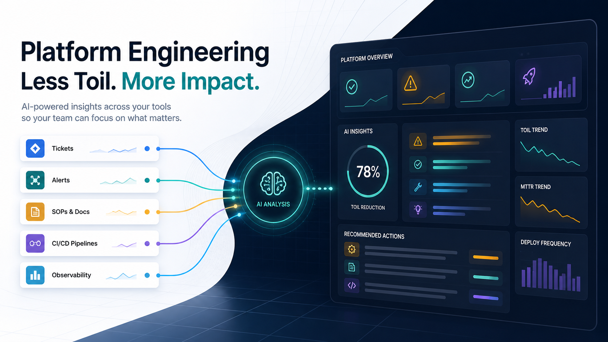

<p align="center">
  
</p>

# Platform Engineering: Reduce Toil with AI

A single-page guide showing how Platform Engineering can reduce repetitive operational work using **JIRA**, **Icinga**, **SOPs**, AI-assisted analysis, KPI tracking, and human validation.

## Live Site

[Open the site](https://mathias-wiederhirn.github.io/platform-engineering-toil-ai-site/)

## What It Covers

- A 7-step method to identify, measure, standardize, automate, and continuously reduce toil
- How to use **JIRA** demand signals, **Icinga** operational alerts, and **SOPs** as evidence
- Minimum vital information required from each source
- What AI can do when incident data is incomplete
- How to define toil KPIs and calculate reduction percentage
- How these steps can be embedded into Denis's bot

## Core Idea

Platform Engineering reduces toil when repeated tickets, recurring alerts, and manual procedures are transformed into reliable golden paths, self-service workflows, and validated automation.

## Toil Reduction Formula

```text
Reduction % = (Baseline - Current) / Baseline x 100
```

Example:

```text
100 repeated access tickets before automation
35 repeated access tickets after automation

(100 - 35) / 100 x 100 = 65% reduction
```

## Repository Structure

```text
.
├── index.html
├── README.md
├── .nojekyll
└── assets/
    └── platform-engineering-toil-ai-hero.png
```

## Built For

Platform teams that want to move from reactive support work to measurable productized services:

- fewer repeated **JIRA** tickets
- fewer noisy **Icinga** alerts
- fewer manual **SOP** executions
- better developer experience
- clearer automation candidates
- measurable toil reduction over time


